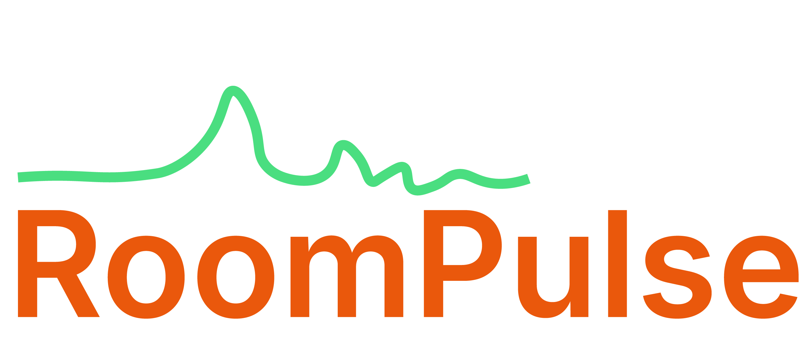

<p align="center">
  
</p>

<p align="center">
  <b>Live polling for talks and lectures.</b><br>
  Your audience answers from their phones; results appear as you speak.
</p>

---

RoomPulse is a self-hosted live polling tool, built for keynotes and
teaching — with a focus on **argumentative and ethical questions**, not just trivia. The
audience joins from any browser with a code or QR (no app, no login); the presenter drives
the deck and sees results update live.

## Features

- **10 question types**: single/multiple choice (with quiz mode and participant-added
  options), Likert scale, word cloud, 2×2 quadrant, ranking (drag & drop), points
  allocation, open text, Q&A with upvotes, *claim + justification*, and a random group
  splitter.
- **Quiz mode** — mark correct answers; participants see if they got it right (the answer is
  never leaked before they respond).
- **Pre/post** — ask the same question before and after your argument and show the shift
  (mean for scales, distribution for choice, centroid arrow for the quadrant).
- **AI argument clustering** — for *claim + justification* and *open text* questions, an LLM
  groups the responses into descriptive themes (two axes for claim+justification: the
  criterion **and** the kind of appeal, with a criterion × appeal matrix). Each presenter
  uses their own Anthropic API key.
- **Live moderation** for free-text answers, **per-owner isolation** (each user only sees
  their own decks), **deck export/import** (JSON) and **data export** (CSV).
- **Trilingual UI** — Italian, English, German.

## How it works

Three surfaces, one fixed join code per deck:

| Surface | Who | What |
|---|---|---|
| **Editor** | presenter | build decks, add/reorder/inspect slides, set the API key |
| **Presenter** | presenter | the projection: active question, live results, controls, QR + code |
| **Audience** | public | enter the code / scan the QR, answer, see results when revealed |

The audience follows the presenter via light polling (no websockets). A deck (template) can
be run many times; each *run* keeps its own responses.

## Quick start

Requires [uv](https://docs.astral.sh/uv/) (it manages Python and dependencies).

```bash
git clone https://github.com/that-ugly-cat/RoomPulse.git
cd RoomPulse

# create the DB + a demo deck and a demo user (spit@local / roompulse)
uv run python seed.py

# run
uv run uvicorn app.main:app --port 8080
```

Then open:

- **Login / editor** — http://localhost:8080/login  (demo: `spit@local` / `roompulse`)
- **Audience** — http://localhost:8080/  (the seed prints the join code)

Create your own presenter account:

```bash
uv run python create_user.py you@example.com yourpassword "Your Name"
```

To enable AI clustering, open the editor, click **⚙**, and paste your Anthropic API key
(stored per user). Get one at <https://console.anthropic.com/>.

## Stack

FastAPI · SQLite · vanilla-JS frontend (static, polling) · `uv`. No build step.

## Deployment

See **[DEPLOY.md](DEPLOY.md)** for production setup (environment variables, Docker, reverse
proxy, backups).

## Tech notes

- Audience endpoints are public (by join code); everything else requires a presenter login.
- Set `JWT_SECRET` in production (there is an insecure default for local dev).
- The whole database is a single SQLite file — back up by copying it.
